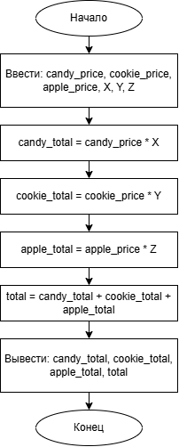

# Домашнее задание к работе 2

## Условие задачи
В течение месяца продавец доставлял на дом 4 л. молока в день. В марте молоко стоило `x` руб. за литр. С первого апреля цена молока увеличилась на `(x + a)` руб. за литр. Сколько надо заплатить продавцу за все доставленное молоко в конце апреля? Количество покупаемого молока осталось прежним.

---

## 1. Алгоритм и блок-схема

### Алгоритм
1. **Начало**
2. Объявить константы:
   - `DAILY_VOLUME` = 4 (л/день) — ежедневный объем покупки.
   - `DAYS_IN_MARCH` = 31 — количество дней в марте.
   - `DAYS_IN_APRIL` = 30 — количество дней в апреле.
3. Задать исходные данные:
   - `x` — цена 1 литра молока в марте (руб.).
   - `a` — величина, на которую базовая цена увеличивается в апреле (руб.).
4. Вычислить стоимость молока в марте:
   - `price_march` = `x`
   - `total_march` = `DAILY_VOLUME` * `DAYS_IN_MARCH` * `price_march`
5. Вычислить новую цену молока в апреле:
   - `price_april` = `x` + (`x` + `a`)
6. Вычислить стоимость молока в апреле:
   - `total_april` = `DAILY_VOLUME` * `DAYS_IN_APRIL` * `price_april`
7. Вычислить общую сумму к оплате:
   - `total_to_pay` = `total_march` + `total_april`
8. Вывести результаты расчетов с подстановкой всех значений в текст.
9. **Конец**

### Блок-схема
 
## 2. Реализация программы

#include <stdio.h>
#include <locale.h>

int main() {
    setlocale(LC_CTYPE, "RUS");
    float price_confetok = 150.0;   
    float price_cookies = 80.0;    
    float price_apples = 60.0;     

    float X = 2.0;    //кол-во конфет             
    float Y = 3.0;    //кол-во печенек             
    float Z = 1.5;                 //кол-во яблок

    
    float cost_confetki, cost_cook, cost_apples;
    float total;                   

    // Вычисления
    cost_confetki = price_confetok * X;
    cost_cook = price_cookies * Y;
    cost_apples = price_apples * Z;
    total = cost_confetki + cost_cook + cost_apples;

    // Вывод 
    printf("-----------------------------------------------\n");
    printf("              ЧЕК ПОКУПКИ\n");
    printf("-----------------------------------------------\n\n");

    printf("Товары:\n");
    printf("  Конфеты:  %6.2f кг по %6.2f руб/кг =%8.2f руб\n",
        X, price_confetok, cost_confetki);
    printf("  Печенье:  %6.2f кг по %6.2f руб/кг =%8.2f руб\n",
        Y, price_cookies, cost_cook);
    printf("  Яблоки:   %6.2f кг по %6.2f руб/кг =%8.2f руб\n",
        Z, price_apples, cost_apples);

    printf("-----------------------------------------------\n");
    printf("  ОБЩАЯ СТОИМОСТЬ ПОКУПКИ:           %8.2f руб\n", total);
    printf("-----------------------------------------------\n\n");

    return 0;
}

## 3. Результаты работы программы

-----------------------------------------------
              ЧЕК ПОКУПКИ
-----------------------------------------------

Товары:
  Конфеты:    2.00 кг по 150.00 руб/кг =  300.00 руб
  Печенье:    3.00 кг по  80.00 руб/кг =  240.00 руб
  Яблоки:     1.50 кг по  60.00 руб/кг =   90.00 руб
-----------------------------------------------
  ОБЩАЯ СТОИМОСТЬ ПОКУПКИ:             630.00 руб
-----------------------------------------------

## 4. Информация о разработчике

Тухватулин Евгений Романович, бТИИ-261
